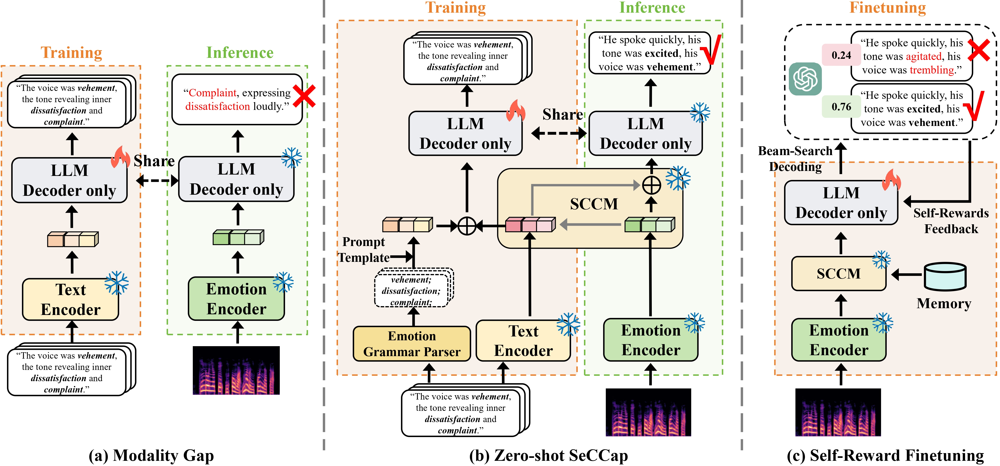

<!-- # Bridging the Modality Gap: Semantic-Calibrated Zero-shot Speech Emotion Captioning with Self-Reward Alignment -->

## An illustration of our proposed model architecture.
<!-- <div align="center">

</div> -->

## 1. Environment setting

### 1.0. Package

* Several important packages
  - torch == 2.0.0
  - torchaudio == 2.0.1
  - transformers == 4.29.0
  - accelerate == 0.19.0
  - deepspeed == 0.8.3


<!-- ### 1.1. Dataset

[Dataset | MultiMediate:Multi-modal Group Behaviour Analysis for Artificial Mediation](https://multimediate-challenge.org/datasets/Dataset_NoXi/)

Download the dataset from the above link to the 'noxi' folder.

```
├── Engagemet Estiamtion/
│   ├── code/
│   │   ├── data
│   │   ├── src
└── └── └── output_model
│   ├── noxi/
│   │   ├── train
│   │   ├── val
└── └── └── test
``` -->

### 1.2. OS

- [x] Windows10
- [x] Ubuntu20.04
- [x] GPU V100-16G * 4

## 2. Train

- [x] stage1 (Semantic Align Pre-training)
- [x] stage2 (Caption-only Training)
- [x] SCCM Pre-training
- [ ] Zero-shot Inference
- [ ] stage3 (Self-Reward Finetuning)

### The complete code will be open source soon.

<!-- (more information: https://pytorch.org/tutorials/intermediate/ddp_tutorial.html) -->

<!-- ### 2.1. Dataset preprocessing

Perform preprocessing operations, normalization, and merging of multi-modal features.

```sh
python process.py
```

Use the center-based sliding window to partition multi-modal feature sequences for training, validation, and testing.

```sh
python CSW.py
```

```
├── code/
│   ├── data/
└── └── └── all_data
```

### 2.3. Train CEAM

```sh
python train.py \
    --N 3 \
    --M 0 \
    --K 0 \
    --save_dir CEAM
```

### 2.4. Train Dialogue Cross-Enhanced CEAM

```sh
python train.py \
    --N 1 \
    --M 1 \
    --K 2 \
    --save_dir DCECEAM
```

## 3. Evaluation

### 3.1. Eval CEAM

```sh
python eval.py \
    --N 3 \
    --M 0 \
    --K 0 \
    --save_dir CEAM
```

### 3.2. Eval Dialogue Cross-Enhanced CEAM

```sh
python eval.py \
    --N 1 \
    --M 1 \
    --K 2 \
    --save_dir DCECEAM
```

## 4. Result

| Model | Method | Val CCC   | Test CCC  | Inference speed （FPS） | Params  (M) |
|:----------------------------------- |:---------------------------:|:---------:|:---------:|:---------------------:|:-----------:|
| SA-based model [Yu et al.]          | Sliding window              | 0.796     | -         | 4537                  | 22.67       |
| BiLSTM-based model [Yu et al.]      | Sliding window              | 0.818     | 0.690     | 1310                  | 36.17       |
| CEAM (Ours)                         | Center-based sliding window | 0.821     | 0.691     | **6455**              | 23.98       |
| Dialogue Cross-Enhanced CEAM (Ours) | Center-based sliding window | **0.835** | **0.704** | 6185                  | 31.07       |

## 5. Model checkpoints

It can be downloaded from Google Cloud Disk:  Pretrained weights will be released later.

It can be directly used for inference and to get the final result.

## References

- Müller P, Balazia M, Baur T, et al. MultiMediate'23: Engagement Estimation and Bodily Behaviour Recognition in Social Interactions[C]//Proceedings of the 31st ACM International Conference on Multimedia. 2023: 9640-9645.
- Yu J, Lu K, Jing M, et al. Sliding Window Seq2seq Modeling for Engagement Estimation[C]//Proceedings of the 31st ACM International Conference on Multimedia. 2023: 9496-9500. -->
